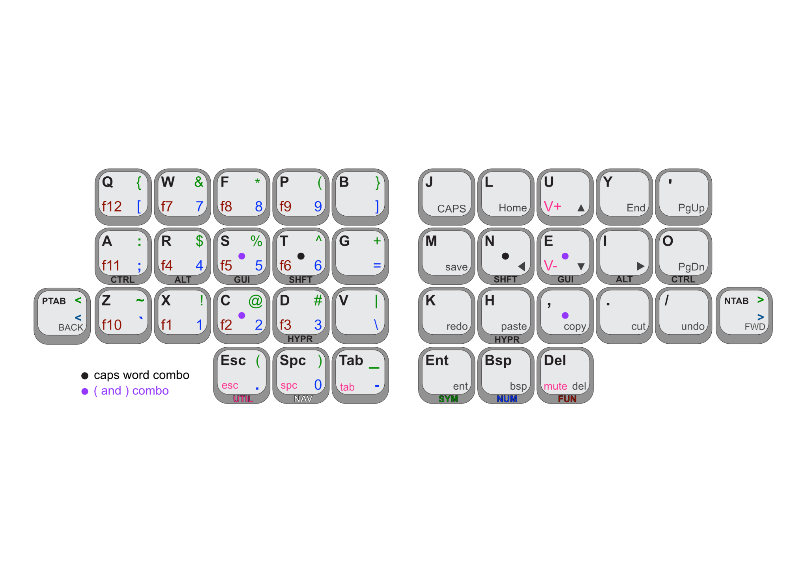

# ZMK Miryoku-inspired firmware for the TOTEM keyboard

<figure>

<figcaption>Keyboard layout for all layers</figcaption>
</figure>

This is a ZMK firmware for a [TOTEM keyboard](https://github.com/GEIGEIGEIST/TOTEM), using a keymap that is pretty much copied from the great [Miryoku layout](https://github.com/manna-harbour/miryoku_zmk#caps-word). I could have used Miryoku directly of course, but I have settled on the features I enjoy from it so can hard code them, rather than needing flexibility, and I prefer my homerow mods to be Shift, Super, Alt, Ctrl (from the index finger to the pinky), rather than Super and Ctrl being swapped as they are in Miryoku ZMK. 

I have added one or two things that are useful to me:

- Combo for caps word on homerow shift keys
- Combo for left and right parens on the middle/bottom row middle finger keys, to make parens more accessible for ordinary typing
- Tab forward/back (default layer), back/forward (nav layer), and angle brackets (num and sym layers) on the extra pinkie keys, to give these useful keys a dedicated home. The angle brackets are otherwise a bit awkward to access for R symbols like `<-`.
